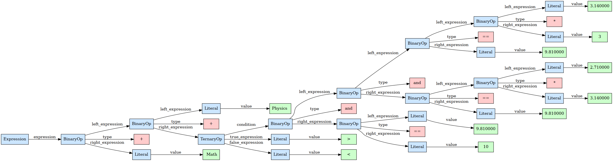

# **Ruja Programming Language**

I like *low level programming*. I'm a fan of C and C++. I want to learn how to create a programming language. So here is ```Ruja```.

## **What is Ruja?**

Find a name is always the worst part of creating a programming language. I don't know why. I just don't like it. I know many languages are named after animal names or have pet mascots (e.g Python, Rust, Go, V etc.). I like howls. I am portuguese. Howl in portuguese is Coruja. Since Coruja is to long for my taste (I don't want to type ```./coruja``` every time I use this language) I named it just ```Ruja```.

I don't have any well structured plan for this language. So far I have been implementing just the basic core of the language. I'm not sure if I will ever finish this project. I'm just doing it for fun and to learn. Maybe in the future there will be such a list.

My most important goal at the moment is to have a functional programming language. Eventually I would like to use **LLVM** but for now I'll keep it simple.

## **Current State of the Language**

### **The Frontend** (**Lexer**, **Parser** and **AST**)

Until the addition of new tokens it will be considered complete. It can lex all the existing language tokens and report simple error messages. The parser algorithm used in this branch is called [Pratt Parsing](https://en.wikipedia.org/wiki/Operator-precedence_parser). Currently only supports expressions with integers, floats, characters and string. The current AST structure is preliminary and will change once the project becomes more mature. The relevant source files are:

- [lexer.h](includes/lexer.h),[lexer.c](src/lexer.c): Definition and Implementation of the lexer.
- [parser.h](includes/parser.h),[parser.c](src/parser.c): Definition and Implementation of the parser.
- [ast.h](includes/ast.h),[ast.c](src/ast.c): Definition and Implementation of the AST.

### **The Bytecode Compiler**

The bytecode compiler is still in its early stages. It can only compile expressions with **integers**, **floats**, **characters** and **strings**. It does not support any kind of control flow asside from ternary expressions. It also does not perform any sort of optimizations to the AST. The relevant source files are:

- [compiler.h](includes/compiler.h),[compiler.h](src/compiler.c): Definition and Implementation of the bytecode compiler.

### **The Virtual Machine**

For now the language compiles to bytecode that is later interpreted by a virtual machine. It is has a stack architecture and only supports basic arithmetic operations, jumps and pushs. It has 8 byte operands and uses [**Nan-Boxing**](https://leonardschuetz.ch/blog/nan-boxing/). The relevent source files are:

- [word.h](includes/word.h),[word.c](src/word.c): Implementation of the word type used by the virtual machine.
- [bytecode.h](includes/bytecode.h),[bytecode.c](src/bytecode.c): Definition and implementation of bytecode intructions, structures, debuggers. 
- [stack.h](includes/stack.h),[stack.c](src/stack.c): Implementation of the stack used by the virtual machine.
- [vm.h](includes/vm.h),[vm.c](src/vm.c): Implementation of the virtual machine.

## **Building**

Since the language core is still being built, there is no quick-start section. To build you need ```gcc```, ```make``` and ```valgrind```.

```bash
git clone <repo-url>
cd Ruja
mkdir -p out/build
cmake -S ../../src
make
```

## **Running**

To run the language go to the [ruja.c](ruja.c) file and toggle the appropriate entry point. Simply rebuild the program. and run with ```make memcheck``` to check for memory leaks or ```./exe/ruja <input-file>``` to simply run.

## **Outputs**

Given the following input

```c
"Physics " + ( 3.14 * 3.14 == 9.81 and 2.71 * 3.14 == 9.81 and 9.81 == 10.0  ? ">" : "<" ) + " Math"
```

the following components of the language output the following.

### **Lexer**

```console
Ruja_Token(STRING,Physics ,1)
Ruja_Token(ADD,+,1)
Ruja_Token(LPAREN,(,1)
Ruja_Token(FLOAT,3.14,1)
Ruja_Token(MUL,*,1)
Ruja_Token(INT,3,1)
Ruja_Token(EQ,==,1)
Ruja_Token(FLOAT,9.81,1)
Ruja_Token(AND,and,1)
Ruja_Token(FLOAT,2.71,1)
Ruja_Token(MUL,*,1)
Ruja_Token(FLOAT,3.14,1)
Ruja_Token(EQ,==,1)
Ruja_Token(FLOAT,9.81,1)
Ruja_Token(AND,and,1)
Ruja_Token(FLOAT,9.81,1)
Ruja_Token(EQ,==,1)
Ruja_Token(INT,10,1)
Ruja_Token(QUESTION,?,1)
Ruja_Token(STRING,>,1)
Ruja_Token(COLON,:,1)
Ruja_Token(STRING,<,1)
Ruja_Token(RPAREN,),1)
Ruja_Token(ADD,+,1)
Ruja_Token(STRING, Math,1)
Ruja_Token(EOF,,1)
```

### **Parser**



### **Compiler**

The compiler will output the following bytecode instructions.

| **IP**    | **Line** | **Instruction**   | **Operand**             |
| :---: | :--: |  :---------:  | :-----:             |
|   0   |    1 |         CONST |            Physics  |
|   5   |    - |         CONST |            3.140000 |
|  10   |    - |         CONST |                   3 |
|  15   |    - |           MUL |               ----- |
|  16   |    - |         CONST |            9.810000 |
|  21   |    - |            EQ |               ----- |
|  22   |    - |         CONST |            2.710000 |
|  27   |    - |         CONST |            3.140000 |
|  32   |    - |           MUL |               ----- |
|  33   |    - |         CONST |            9.810000 |
|  38   |    - |            EQ |               ----- |
|  39   |    - |           AND |               ----- |
|  40   |    - |         CONST |            9.810000 |
|  45   |    - |         CONST |                  10 |
|  50   |    - |            EQ |               ----- |
|  51   |    - |           AND |               ----- |
|  52   |    - |            JZ |                  15 |
|  57   |    - |         CONST |                   > |
|  62   |    - |          JUMP |                  10 |
|  67   |    - |         CONST |                   < |
|  72   |    - |           ADD |               ----- |
|  73   |    - |         CONST |                Math |
|  78   |    - |           ADD |               ----- |
|  79   |    0 |          HALT |               ----- |

### **Virtual Machine**

The virtual machine will execute the previous bytecode and output the following.

```console
CONST STACK[0]: [ ]
CONST STACK[1]: [ Physics  ]
CONST STACK[2]: [ Physics  3.140000 ]
  MUL STACK[3]: [ Physics  3.140000 3 ]
CONST STACK[2]: [ Physics  3 ]
   EQ STACK[3]: [ Physics  3 9.810000 ]
CONST STACK[2]: [ Physics  false ]
CONST STACK[3]: [ Physics  false 2.710000 ]
  MUL STACK[4]: [ Physics  false 2.710000 3.140000 ]
CONST STACK[3]: [ Physics  false 8.509400 ]
   EQ STACK[4]: [ Physics  false 8.509400 9.810000 ]
  AND STACK[3]: [ Physics  false false ]
CONST STACK[2]: [ Physics  false ]
CONST STACK[3]: [ Physics  false 9.810000 ]
   EQ STACK[4]: [ Physics  false 9.810000 10 ]
  AND STACK[3]: [ Physics  false false ]
   JZ STACK[2]: [ Physics  false ]
CONST STACK[1]: [ Physics  ]
  ADD STACK[2]: [ Physics  < ]
CONST STACK[1]: [ Physics < ]
  ADD STACK[2]: [ Physics <  Math ]
 HALT STACK[1]: [ Physics < Math ]
```